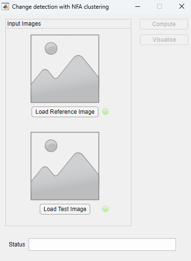

# ChangeDetection_NFAclustering
This project is the implementation of change detection using Number of False Alarm (NFA) clustering presented in the following papers:

[A-contrario framework for detection of alterations in varnished surfaces](https://www.sciencedirect.com/science/article/pii/S1047320321002352)

[Analysis of Multi-temporal Image Series for the Preventive Conservation of Varnished Wooden Surfaces](https://link.springer.com/chapter/10.1007/978-3-030-90439-5_14)

## Main functions
This code base includes one GUI Matlab App and two main console functions:
- *ChangeDetectionPair.mlapp* is a GUI Matlab App which accepts a pair of images as input and visualises the change between the two as a list of clusters. 

- *ChangeDetection.m* is a console function which can be used as an alternative to the app above. It returns a list of possible changed clusters between the two image. To visualise the results the following functions can be used: *top_n_label.m*, *top_n_mask.m*, *top_n_overlay.m*, *visualisePointCloud.m*.
- *ChangeDetectionSeries.m* is a console function which gets a series of images as input and returns a list of 3D clusters of possible changed points compared to the first image. The list is sorted based on it's significance spatially and temporally. To visualise the results the function *visualiseTopn3Dclusters.m* can be used.

